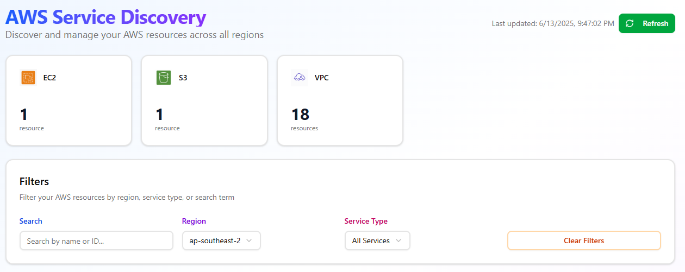
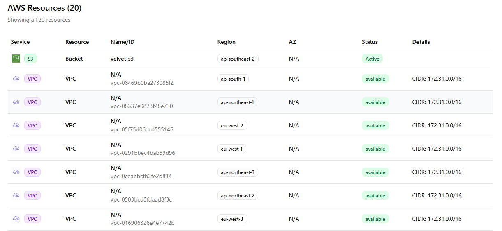

# AWS Service Discovery Application

A comprehensive web application that scans all AWS regions and lists all provisioned services across different regions and availability zones. The application features a modern, vibrant UI with AWS service logos and supports discovery of 11 different AWS service types.

## Features

### 🎯 Core Functionality
- **Multi-Region Scanning**: Automatically scans all available AWS regions
- **Comprehensive Service Discovery**: Supports 11 AWS service types
- **Real-time Filtering**: Filter by region, service type, and search terms
- **Parallel Processing**: Fast scanning with concurrent region processing
- **Professional UI**: Modern interface with AWS service icons and color coding

### 🛠️ Supported AWS Services
1. **EC2 Instances** - Virtual servers with instance types and states
2. **S3 Buckets** - Object storage with regional information
3. **Lambda Functions** - Serverless functions with runtime details
4. **RDS Instances** - Managed databases with engine information
5. **VPC Networks** - Virtual private clouds with CIDR blocks
6. **ELB Load Balancers** - Classic, Application, and Network load balancers
7. **CloudFormation Stacks** - Infrastructure as code deployments
8. **ECS Clusters** - Container orchestration services
9. **SNS Topics** - Simple notification service topics
10. **SQS Queues** - Simple queue service queues
11. **DynamoDB Tables** - NoSQL database tables

### 🎨 Enhanced UI Features
- **Service Icons**: Custom AWS-style icons for each service type
- **Color Coding**: Professional color schemes for easy service identification
- **Summary Cards**: Visual overview of resource counts by service type
- **Responsive Design**: Works on desktop and mobile devices
- **Interactive Filtering**: Real-time search and filter capabilities

## Architecture

### Backend (Flask)
- **Framework**: Flask with CORS support
- **AWS Integration**: Boto3 for AWS API interactions
- **Parallel Processing**: Concurrent scanning across regions
- **Error Handling**: Comprehensive error handling and logging
- **RESTful API**: Clean API endpoints for frontend communication

### Frontend (React)
- **Framework**: React with modern hooks
- **Styling**: Tailwind CSS for responsive design
- **Icons**: Custom AWS service icons and Lucide React icons
- **State Management**: React hooks for state management
- **Real-time Updates**: Dynamic filtering and search

## Prerequisites

- Python 3.11+
- Node.js 20+
- AWS Account with appropriate permissions
- AWS credentials (Access Key ID and Secret Access Key)

## Installation

### 1. Clone the Repository
```bash
git clone <repository-url>
cd aws-service-discovery-app
```

### 2. Backend Setup
```bash
cd aws-service-discovery
python -m venv venv
source venv/bin/activate  # On Windows: venv\Scripts\activate
pip install -r requirements.txt
```

### 3. Frontend Setup
```bash
cd ../aws-service-discovery-frontend
npm install
```

### 4. AWS Credentials Configuration
Create a `.env` file in the `aws-service-discovery` directory:
```bash
cp .env.example .env
```

Edit the `.env` file with your AWS credentials:
```env
AWS_ACCESS_KEY_ID=your_access_key_here
AWS_SECRET_ACCESS_KEY=your_secret_key_here
AWS_DEFAULT_REGION=us-east-1
```

**⚠️ Security Note**: Never commit your `.env` file to version control. The `.gitignore` files are configured to exclude it.

## Usage

### 1. Start the Backend Server
```bash
cd aws-service-discovery
source venv/bin/activate
python src/main.py
```

## Screenshots

Here are some screenshots of the application:




The backend will start on `http://localhost:5000`

### 2. Start the Frontend Development Server
```bash
cd aws-service-discovery-frontend
npm run dev
```
The frontend will start on `http://localhost:5173`

### 3. Access the Application
Open your browser and navigate to `http://localhost:5173`

## API Endpoints

### Health Check
- **GET** `/api/health` - Check API health status

### Regions
- **GET** `/api/regions` - Get all available AWS regions

### Services
- **GET** `/api/services` - Get all services across all regions
- **GET** `/api/services/<region>` - Get services in a specific region
- **GET** `/api/services/summary` - Get service summary by region

## Configuration

### Environment Variables
The application uses the following environment variables (configured in `.env`):

- `AWS_ACCESS_KEY_ID` - Your AWS Access Key ID
- `AWS_SECRET_ACCESS_KEY` - Your AWS Secret Access Key
- `AWS_DEFAULT_REGION` - Default AWS region (optional, defaults to us-east-1)

### AWS Permissions
Your AWS credentials need the following permissions:
- `ec2:DescribeInstances`
- `ec2:DescribeRegions`
- `ec2:DescribeVpcs`
- `s3:ListBuckets`
- `s3:GetBucketLocation`
- `lambda:ListFunctions`
- `rds:DescribeDBInstances`
- `elasticloadbalancing:DescribeLoadBalancers`
- `cloudformation:DescribeStacks`
- `ecs:ListClusters`
- `ecs:DescribeClusters`
- `sns:ListTopics`
- `sns:GetTopicAttributes`
- `sqs:ListQueues`
- `sqs:GetQueueAttributes`
- `dynamodb:ListTables`
- `dynamodb:DescribeTable`

## Development

### Project Structure
```
aws-service-discovery-app/
├── aws-service-discovery/          # Flask backend
│   ├── src/
│   │   ├── main.py                 # Main application file
│   │   └── routes/
│   │       └── aws_services.py     # AWS service discovery routes
│   ├── .env.example                # Environment variables template
│   ├── .gitignore                  # Git ignore rules
│   └── requirements.txt            # Python dependencies
├── aws-service-discovery-frontend/ # React frontend
│   ├── src/
│   │   ├── App.jsx                 # Main React component
│   │   ├── App.css                 # Styling
│   │   └── assets/                 # Service icons and images
│   ├── .gitignore                  # Git ignore rules
│   └── package.json                # Node.js dependencies
└── README.md                       # This file
```

### Adding New AWS Services
To add support for new AWS services:

1. **Backend**: Add a new scanning function in `aws_services.py`
2. **Frontend**: Add the service icon and color mapping in `App.jsx`
3. **Update**: Add the service to the `scan_region()` function

### Customizing the UI
- **Service Icons**: Replace icons in `src/assets/` directory
- **Colors**: Modify the `serviceColors` object in `App.jsx`
- **Styling**: Update `App.css` for custom styling

## Troubleshooting

### Common Issues

1. **AWS Credentials Error**
   - Ensure your `.env` file is properly configured
   - Verify your AWS credentials have the required permissions
   - Check that the `.env` file is in the correct directory

2. **Backend Connection Error**
   - Ensure the Flask server is running on port 5000
   - Check that CORS is properly configured
   - Verify the API_BASE_URL in the frontend matches the backend

3. **Slow Scanning**
   - This is normal for accounts with many regions/resources
   - The application uses parallel processing to optimize performance
   - Consider filtering by specific regions if needed

### Performance Optimization
- The application scans all AWS regions by default
- For faster results, consider modifying the code to scan specific regions only
- Increase the ThreadPoolExecutor max_workers for faster parallel processing

## Security Considerations

- **Never commit AWS credentials** to version control
- **Use IAM roles** in production environments instead of access keys
- **Implement least privilege** access for AWS permissions
- **Regularly rotate** AWS access keys
- **Monitor AWS CloudTrail** for API usage

## Contributing

1. Fork the repository
2. Create a feature branch
3. Make your changes
4. Add tests if applicable
5. Submit a pull request

## License

This project is licensed under the MIT License - see the LICENSE file for details.

## Support

For support and questions:
- Check the troubleshooting section above
- Review AWS documentation for service-specific issues
- Ensure your AWS credentials have the required permissions
